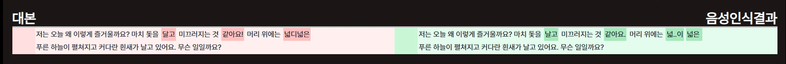

# ***PERSONA***

## **: AI 연기 분석 플랫폼**

# ✔ Project Summary

### 개발 기간 : 2023.02/20 ~ 2023.03/03

## Back-Ground

- **연기에 대한 관심 증가**로 인한 연기희망자 증가
- 연기를 취미로 가지는 사람역시 증가중

## 사용자 요구 분석

- **표정으로 감정을 측정하는 기능 필요**
- **발음을 교정하는 온라인 서비스의 요구**

## 서비스 설명

- 대본 및 인물 정보 제공을 통한 대본 분석 공간 제공
- AI 를 통한 감정 분석 및 발음 정확도 분석
- 연습 연상에 대한 셀프 모니터링 환경 제공

---

## 설계 및 산출물

- **ERD 및 Architecture**

- **API 및 아케텍쳐**

 

## 메인 기능

- AI영상 분석 모델을 활용한 감정인식
- 음성인식을 통해 발음을 인식하고 대본과 일치하는 지 체크
- 완료된 연기 후 영상을 그래프를 통해 분석 가능

## 추가 기능

- 카카오,구글,네이버 로그인
- 커뮤니티

## 메인 기능 설명

- **대본 및 인물 정보 제공을 통한 대본 분석 공간 제공**
         

- **감성 인식 & 발음 인식**    

**TenserFlow**를 이용하여 연기자의 감정 분석    

**whisper Api**를 이용, 
사용자의 음성을 인식하여 대본과 얼마나 일치하는지 비교,
틀린부분을 체크하여 보여줌

## 기대 효과

- ai 분석을 통한 자신의 연기 분석
- 발음 교정
- 연기자를 향한 입문 난이도를 낮춤

---

- 소셜 **로그인**

- AI영상 분석 모델을 활용한 감정인식

 
- Whisper API 를 통한 음성 인식

## 개발 환경

---

### **Back-End**

| IntelliJ | ---|
| --- | --- |
| JDK | 11.0.13 |
| SpringBoot | 2.7.8 |
| dependency | 1.0.15 |
| gradle | 7.6 |
| jwt | 0.9.1 |
| JPA |  |

### Front-End

| Node.js | 18.13.0 |
| --- | --- |
| React | 17.0.2 |
| VS Code | 1.75.1 |
| Create-react-app | 5.0.1 |
| React-router-dom | 6.2.0 |
| npm | 8.19.3 |
| recoil | 0.7.7 |
| CSS |  |

## 배포(CI/CD)

---

- AWS EC2 - ubuntu os 20.04 LTS
- Docker
- Nginx
    - backend , frontend 포워딩 분기 처리
- Jenkins
    - pipeline 스크립트 작성으로 빌드 명령 자동화
    - webhook을 이용한 빌드 유발 자동 배포
- https
    - letsencrypty 인증서 발급(j8b304.p.ssafy.io](http://j8b304.p.ssafy.io/))

# ✔ **Cooperation**

## Tools

- Git
- Jira
- Notion
- MatterMost
- Webex

## 팀원 소개

- 김소진 (팀장) - Front-End
- 조은서 (팀원) - Front-End
- 현승민 (팀원) - AI
- 이인호 (팀원) - AI
- 이상학 (팀원) - Back-End
- 남기정 (팀원) - Back-End
    
## 시연영상
- 메인화면 > 로그인    
   

- 대본 검색 기능, 북마크 기능    
    

- 영상 분석 > 연기 연습 > 음성분석, 감정분석 내용 저장    
    

- 연기 피드백 게시글 등록 및 댓글 등록, 좋아요    

